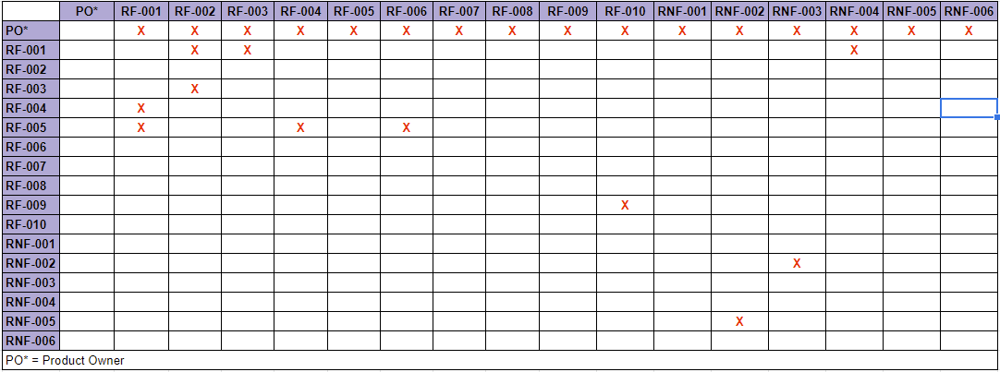
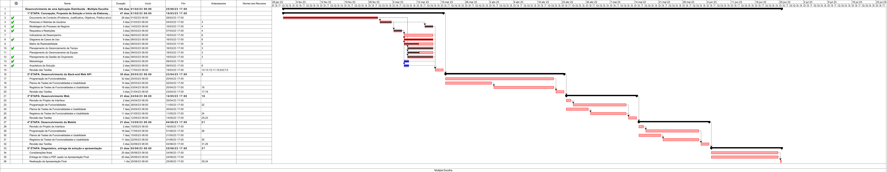

# Especificações do Projeto

A definição do problema e dos pontos mais relevantes relacionados ao projeto foi realizada por meio de discussões entre os membros da equipe. Os pontos mais relevantes observados durante as discussões foram então consolidados na por meio da elaboração de personas e histórias de usuário, que são mostradas nas seções a seguir.

## Personas

|Felipe Alves      | Informações:                       |                                        |
|--------------------|------------------------------------|----------------------------------------|
|  | **Idade:** 32   **Ocupação:** Professor particular de inglês |**Aplicativos:** ● Whatsapp  ● Instagram ● Facebook  |
|**Motivações:** ● Obter mais engajamento de seus  alunos com as listas de exercício de inglês. ●  Obter mais alunos para suas  aulas particulares. |**Frustrações:** ● Baixa aderência de seus alunos aos exercícios de reforço que ele disponibiliza.  ● Não possuir tantos alunos quanto gostaria. |**Hobbies:** ● Vídeo games ● Música  ● Séries |

|Camila Soares      | Informações:                       |                                        |
|--------------------|------------------------------------|----------------------------------------|
|  | **Idade:** 20   **Ocupação:** Vestibulanda |**Aplicativos:** ● Tiktok  ● Instagram ● Whatsapp  |
|**Motivações:** ● Ser aprovada no vestibular de  medicina da UFMG. ●  Ter uma carreira bem  sucedida como médica cardiologista. |**Frustrações:** ● Dificuldade em manter o ritmo nos estudos.  ● Dificuldade em avaliar seu progresso em sua preparação para o vestibular. |**Hobbies:** ● Viajar ● Séries  ● Animais de estimação |

|Márcia Rodrigues      | Informações:                       |                                        |
|--------------------|------------------------------------|----------------------------------------|
|  | **Idade:** 46   **Ocupação:** Diretora de escola particular |**Aplicativos:** ● LinkedIn  ● Gmail ● Twitter  |
|**Motivações:** ● Integrar novas tecnologias de ensino em sua escola. ●  Obter melhor desempenho dos alunos de sua escola. |**Frustrações:** ● Sentir que sua escola está defasada na adoção de novas tecnologias na sala de aula.  ● Reclamações dos professores em relação a adesão dos alunos as tarefas de casa. |**Hobbies:** ● Leitura ● Praticar exercício físico  ● Natureza |

|Roberto Castro      | Informações:                       |                                        |
|--------------------|------------------------------------|----------------------------------------|
|  | **Idade:** 25   **Ocupação:** Vendedor em loja de roupas e estudante em curso de administração EAD |**Aplicativos:** ● Facebook  ● Twitter ● Gmail  |
|**Motivações:** ● Concluir seu curso de administração. ●  Obter uma promoção para gerente de  vendas em seu emprego. |**Frustrações:** ● Dificuldade para acompanhar as tarefas do curso.  ● Dificuldade em conciliar o tempo entre os estudos e o trabalho. |**Hobbies:** ● Cozinhar ● Viajar  ● Séries |

|Sabrina Almeida      | Informações:                       |                                        |
|--------------------|------------------------------------|----------------------------------------|
|  | **Idade:** 27   **Ocupação:** Arquiteta, estudante de curso de francês |**Aplicativos:** ● Instagram  ● Twitter ● TikTok  |
|**Motivações:** ● Se tornar fluente em francês. ● Conseguir um emprego na frança  e se mudar para o país. |**Frustrações:** ● Dificuldade em acompanhar as tarefas do seu curso de francês.  ● Não ter obtido uma boa pontuação no último exame de proficiência  em francês que realizou. |**Hobbies:** ● Viajar ● Tirar fotos  ● Postar em redes sociais |

## Histórias de Usuários

A partir da análise das personas elaboradas, foram levantadas as histórias de usuários mostradas abaixo:

|EU COMO... `PERSONA`| QUERO/PRECISO ... `FUNCIONALIDADE` |PARA ... `MOTIVO/VALOR`                 |
|--------------------|------------------------------------|----------------------------------------|
|Felipe Alves        | Ter acesso a uma plataforma aonde possa cadastrar e enviar listas de tarefas para meus alunos. |Facilitar o processo de passar listas de tarefas para seus alunos. |
|Felipe Alves        | Poder acompanhar as métricas de adesão e desempenho dos alunos nas atividades. | Poder avaliar se os alunos estão aderindo as listas de exercício e se estão tendo dificuldade com algum tema específico delas. |
|Camila Soares        | Ter acesso a uma plataforma onde posso fazer listas de exercício das matérias que estou estudando em qualquer lugar. | Aumentar sua aderência e frequência de realização das atividades de reforço para melhorar seu aprendizado. |
|Camila Soares        | Ter acesso a uma plataforma aonde posso acompanhar meu progresso no aprendizado das matérias com professores particulares ou de cursinho. | Organizar melhor sua rotina de estudos e poder avaliar melhor os pontos que precisa estudar mais. |
|Márcia Rodrigues        | Ter acesso a uma plataforma que permita que os professores da minha escola passem tarefas para os alunos por meio de aplicativo. | Modernizar o processo de ensino na minha escola. |
|Márcia Rodrigues        | Ter acesso a uma plataforma que recolha e disponibilize métricas em relação a adesão e desempenho dos alunos nas tarefas de casa. | Permitir um melhor acompanhamento dos professores no processo de aprendizado dos alunos. |
|Roberto Castro        | Ter acesso a todas as minhas atividades do curso organizadas em um único aplicativo. | Poder planejar melhor o meu tempo para realização das tarefas do meu curso. |
|Sabrina Almeida | Ter acesso a uma plataforma aonde eu possa praticar questões para os exames que vou realizar. | Praticar para melhorar meu desempenho nos próximos exames. |
|Sabrina Almeida | Ter acesso a uma plataforma onde meu professor possa avaliar as métricas do meu desempenho nas tarefas para determinar quais são os pontos em que preciso melhorar. | Ter um melhor direcionamento do meu processo de aprendizado nas minhas aulas particulares. |

## Modelagem do Processo de Negócio 

### Análise da Situação Atual

O processo normalmente realizado por professores de passar listas de atividades para seus alunos e corrigi-las, seja para fins de reforço ou para fins de avaliação, geralmente passa por uma sequencia similar a ilustrada na figura abaixo, aonde o professor elabora a lista de atividades, a encaminha para o aluno (seja por e-mail ou presencialmente, entregando listas impressas em papel na sala de aula) e estabelece um prazo para a entrega. O aluno então responde as questões da lista e a retorna para o professor (por e-mail ou pessoalmente), que por sua vez realiza a correção das questões uma a uma e atribui uma nota para o aluno baseado em suas respostas, lançando-a em algum sistema online ou repassando a correção físicamente para o aluno para que este possa saber sobre sua nota e seu desempenho na atividade.  

<b>Figura</b> - Análise da situação atual

 

### Descrição Geral da Proposta

Nossa proposta consiste no desenvolvimento de uma aplicação distribuída (possuindo uma versão web e uma versão mobile) aonde o professor possa se cadastrar e criar uma turma na qual cadastrará as atividades que deseja passar para os alunos. Os alunos então poderão se cadastrar no aplicativo e solicitar participação nessas turmas, tendo então acesso a todas as atividades cadastradas pelo professor. As atividades cadastradas terão associadas a elas um prazo de entrega, nota máxima, nota de cada questão e um gabarito (que não ficará visível para o aluno), sendo limitadas somente a atividades de múltipla escolha para evitar que o escopo do projeto se torne inviável. Ao selecionar uma atividade, os alunos poderão selecionar a resposta que desejam marcar para cada questão e por fim submeter a atividade, que será corrigida na hora utilizando o gabarito, além disso, a atividade com as respostas selecionadas pelo aluno também ficaria salva para poder ser vista posteriorimente. Por fim, o sistema também coletaria métricas relativas ao desempenho de cada aluno nas atividades da turma, disponibilizando-as para o aluno e também para o professorda turma. As figuras abaixo ilustram os processos da solução.

### Processo 1 – Cadastro de conta pelo usuário

O primeiro processo apresentado consiste no cadastro de contas pelos usuários na aplicação. O usuário poderá se cadastrar tanto com uma conta do tipo "professor", que poderá criar novas turmas e cadastrar atividades nelas, como com uma conta tipo "aluno", que poderá participar de turmas criadas por usuários do tipo "professor" e ter acesso a todas as atividades nelas postadas para realizar.

<b>Figura</b> - Processo 1: Cadastro de conta pelo usuário.

 

### Processo 2 – Cadastro de atividade por usuário do tipo "professor"

O segundo processo apresentado consiste no cadastro de atividades pelo professor. Para cadastrar uma atividade, o usuário do tipo "professor" deve primeiro selecionar a turma a qual a atividade pertence (ou criar uma nova turma caso esta ainda não exista) e então preencher os dados da atividade (nome, prazo para entrega, elaborar as questões, gabarito) e submete-la para que o sistema a salve no banco de dados.

<b>Figura</b> - Processo 2: Cadastro de atividade por usuário do tipo "professor".

 

### Processo 3 – Realização de atividade por usuário do tipo "aluno"

O terceiro processo apresentado consiste na realização das atividades cadastradas pelo professor pelo aluno. Para fazer isso, o usuário logado como "aluno" deverá selecionar a turma da atividade em questão e ir até a lista de atividades disponíveis e seleciona a atividade que deseja realizar. Caso a atividade esteja dentro do prazo, o aluno poderá então preencher e submete-la, recebendo a nota logo em seguida após a correção automática pelo sistema.

<b>Figura</b> - Processo 3: Realização de atividade por usuário do tipo "aluno".

 

### Processo 4 – Visualização de métricas de aluno em uma turma por usuário do tipo "aluno" ou "professor"

O quarto processo apresentado consiste na visualização de métricas relativas ao desempenho de um aluno em uma turma pelo próprio aluno ou pelo professor da turma. O usuário deverá selecionar a turma para a qual deseja visualizar as métricas do aluno e, caso seja um usuário do tipo "professor" selecionar qual o aluno da turma cujas métricas deseja visualizar. Por fim o sistema retorna as métricas do aluno em questão.

<b>Figura</b> - Processo 4: Realização de atividade por usuário do tipo "aluno".

 

## Indicadores de Desempenho

Apresente aqui os principais indicadores de desempenho e algumas metas para o processo. Atenção: as informações necessárias para gerar os indicadores devem estar contempladas no diagrama de classe. Colocar no mínimo 5 indicadores. 

Usar o seguinte modelo: 

Obs.: todas as informações para gerar os indicadores devem estar no diagrama de classe a ser apresentado a posteriori. 

## Requisitos

As tabelas que se seguem apresentam os requisitos funcionais e não funcionais que detalham o escopo do projeto. Para determinar a prioridade de requisitos, aplicar uma técnica de priorização de requisitos e detalhar como a técnica foi aplicada.

### Requisitos Funcionais

|ID    | Descrição do Requisito  | Prioridade |
|------|-----------------------------------------|----|
|RF-001| Permitir que o usuário se cadastre como professor ou aluno. | ALTA | 
|RF-002| Permitir que o usuário do tipo "professor" cadastre novas turmas associadas a ele. | ALTA |
|RF-003| Permitir que o usuário do tipo "professor" cadastre atividades de multipla escolha associadas as turmas das quais é dono. | ALTA |
|RF-004| Permitir que o usuário do tipo "aluno" se matricule em turmas existentes. | ALTA |
|RF-005| Permitir que o usuário do tipo "aluno" tenha acesso a todas as atividades de multipla escolha cadastradas nas turmas das quais participa. | ALTA |
|RF-006| Permitir que o usuário do tipo "aluno" possa realizar qualquer atividade de multipla escolha que não esteja com o prazo vencido ou com o limite de tentativas alcançado. | ALTA |
|RF-007| Permitir que o aluno tenha acesso as próprias métricas relativas às atividades de multipla escolha que já realizou. | MÉDIA |
|RF-008| Permitir que o professor tenha acesso as métricas de desempenho de todos os alunos cadastrados em alguma de suas turmas. | ALTA |
|RF-009| O sistema deve enviar avisos para os alunos quando uma nova atividade for cadastrada. | BAIXA |
|RF-009| O sistema deve enviar avisos para os alunos quando uma atividade ainda não realizada estiver perto do prazo de entrega. | BAIXA |

### Requisitos não Funcionais

|ID     | Descrição do Requisito  |Prioridade |
|-------|-------------------------|----|
|RNF-001| O módulo de backend do sistema deverá ser desenvolvido na linguagem C# | ALTA |
|RNF-002| Os módulo de frontend do sistema deverão ser desenvolvidos na linguagem Javascript | ALTA |
|RNF-003| O módulo de frontend mobile do sistema devera rodar tanto em Android quanto em IoS | MÉDIA |
|RNF-004| O sistema deve proteger os dados sensíveis do usuário por meio de criptografia | ALTA |
|RNF-005| A interface do sistema deve ser intuitiva, permitindo que o usuário utilize suas funcionalidades sem a necessidade de materiais de ajuda | MÉDIA |
|RNF-006| O sistema deve processar requisições do usuário em no máximo 3s |  BAIXA | 

## Restrições

O projeto está restrito pelos itens apresentados na tabela a seguir.

|ID| Restrição                                             |
|--|-------------------------------------------------------|
|01| O projeto deverá ser entregue até o final do semestre |
|02| O projeto deverá possuir um módulo distinto para frontend mobile e o frontend web, e não apenas um único módulo frontend responsivo que pode ser acessado como web ou mobile |
|03| O backend do projeto deverá ser desenvolvido como uma API REST capaz de receber requisições e retornar respostas tanto para o frontend mobile quanto para o frontend web |

## Diagrama de Casos de Uso

O diagrama abaixo ilustra as principais ligações entre atores e casos de uso em relação aos Requisitos Funcionais da solução.

<b>Figura</b> - Diagrama de casos de uso da solução.

 

# Matriz de Rastreabilidade

A matriz de rastreabilidade é uma ferramenta usada para facilitar a visualização dos relacionamento entre requisitos e outros artefatos ou objetos, permitindo a rastreabilidade entre os requisitos e os objetivos de negócio. 

A matriz deve contemplar todos os elementos relevantes que fazem parte do sistema, conforme a figura meramente ilustrativa apresentada a seguir.

> **Links Úteis**:
> - [Artigo Engenharia de Software 13 - Rastreabilidade](https://www.devmedia.com.br/artigo-engenharia-de-software-13-rastreabilidade/12822/)
> - [Verificação da rastreabilidade de requisitos usando a integração do IBM Rational RequisitePro e do IBM ClearQuest Test Manager](https://developer.ibm.com/br/tutorials/requirementstraceabilityverificationusingrrpandcctm/)
> - [IBM Engineering Lifecycle Optimization – Publishing](https://www.ibm.com/br-pt/products/engineering-lifecycle-optimization/publishing/)

# Gerenciamento de Projeto

De acordo com o PMBoK v6 as dez áreas que constituem os pilares para gerenciar projetos, e que caracterizam a multidisciplinaridade envolvida, são: Integração, Escopo, Cronograma (Tempo), Custos, Qualidade, Recursos, Comunicações, Riscos, Aquisições, Partes Interessadas. Para desenvolver projetos um profissional deve se preocupar em gerenciar todas essas dez áreas. Elas se complementam e se relacionam, de tal forma que não se deve apenas examinar uma área de forma estanque. É preciso considerar, por exemplo, que as áreas de Escopo, Cronograma e Custos estão muito relacionadas. Assim, se eu amplio o escopo de um projeto eu posso afetar seu cronograma e seus custos.

## Gerenciamento de Tempo

O gráfico de Gantt é uma ferramenta visual para gerenciar o cronograma de atividades de um projeto. Ele lista as atividades necessárias, as divide em etapas e estima o tempo necessário para executá-las. A seguir, há uma imagem da utilização do gráfico de Gantt para este projeto.

A imagem expandida pode ser [visualizada aqui](https://raw.githubusercontent.com/ICEI-PUC-Minas-PMV-ADS/pmv-ads-2023-1-e4-proj-infra-t1-time3-aplicacao-multipla-escolha/main/docs/img/02-gantt-multipla-escolha.png).

## Gerenciamento de Equipe

O gerenciamento adequado de tarefas contribuirá para que o projeto alcance altos níveis de produtividade. Por isso, é fundamental que ocorra a gestão de tarefas e de pessoas, de modo que os times envolvidos no projeto possam ser facilmente gerenciados. 

## Gestão de Orçamento

O processo de determinar o orçamento do projeto é uma tarefa que depende, além dos produtos (saídas) dos processos anteriores do gerenciamento de custos, também de produtos oferecidos por outros processos de gerenciamento, como o escopo e o tempo.

