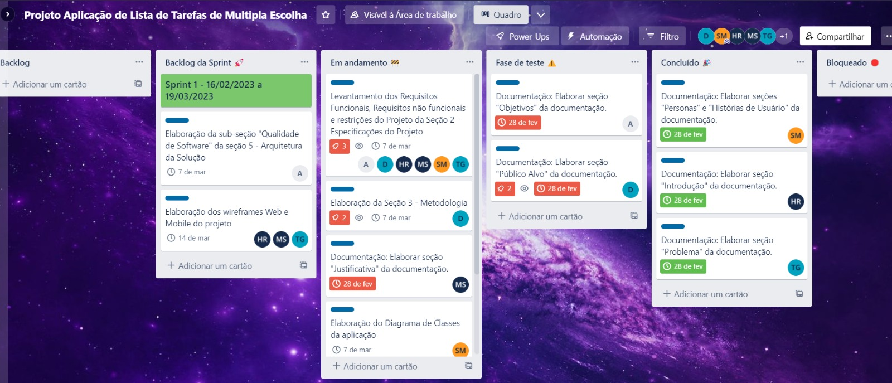

# Metodologia

A metodologia define as ferramentas utilizadas pela equipe. As seções presentes abaixo descrevem os ambientes de trabalhos utilizados pela equipe, além da estrutura utilizada para gestão do código fonte e a definição do processo e ferramenta através dos quais a equipe se organiza (Gestão de Times).

## Relação de Ambientes de Trabalho

As alternativas do projeto são elaboradas a partir de diversas plataformas e a relação dos ambientes com seu propósito a respeito é apresentada conforme a tabela:

Ambiente|Plataforma|Link de Acesso
|:--------|:----------:|:-------------:|
|Repositório de código fonte|GitHub| [GitHub](https://github.com/ICEI-PUC-Minas-PMV-ADS/pmv-ads-2023-1-e4-proj-infra-t1-time3-aplicacao-multipla-escolha)|
|Documentos do Projeto|GitHub (docs/)|[Projeto ](https://github.com/ICEI-PUC-Minas-PMV-ADS/pmv-ads-2023-1-e4-proj-infra-t1-time3-aplicacao-multipla-escolha/tree/main/docs)|
|Criação de Diagramas| Figma, Lucidchart | [figma.com](), [lucid.app](), [lucid.app]() |
|Projeto de Interface e Wireframes| Figma | [Figma]()|
|Gerenciamento do Projeto| Trello |[Trello](https://trello.com/b/UIqoSX9s/projeto-aplica%C3%A7%C3%A3o-de-lista-de-tarefas-de-multipla-escolha)|

## Controle de Versão

Para a gestão do código fonte será utilizado o modelo de processo baseado no
[Git](https://git-scm.com/), sendo que o [Github](https://github.com)
foi utilizado para hospedagem do repositório.

O projeto segue a seguinte convenção para o nome de branches:

- `main`: versão estável já testada do software
- `b/`: resolução de bugs (bug fix)
- `f/`: implementações de novas funcionalidades (feature)
- `d/`: desenvolvimento de documentações

As branches deverão utilizar os prefixos sitados acima e a seguinte convenção para especificação do nome:
- [prefixo] + nome-da-tarefa
    * Exemplo: `d/controle-de-versão`

Quanto à gerência de issues, o projeto adota a seguinte convenção para
etiquetas:

- `documentation`: melhorias ou acréscimos à documentação
- `testing`: teste de implementações
- `bug`: uma funcionalidade encontra-se com problemas
- `enhancement`: uma funcionalidade precisa ser melhorada
- `feature`: uma nova funcionalidade precisa ser introduzida

Utilizaremos a criação de `Pull Requests` para mantermos historico do nosso processo de desenvolvimento. Trazendo assim, confiabilidade ao subir nossas features para a branch `main` que será nosso ambiente de `produção`. Esta convenção trará mais segurança ao nosso ambiente de produção, uma vez que as pull requests terão que ser aprovadas por pelo menos um integrante do grupo.

## Gerenciamento de Projeto

### Divisão de Papéis

Divisão de papéis entre os membros do grupo.

- Scrum Master: Sérgio Luiz De Menezes Filho;
- Product Owner: Hestefani Romão Durães;
- Equipe de Desenvolvimento: Álvaro Alfaya Fonseca, Denio Gonçalves de Lima, Mychel Costa da Silva, Talles Monteiro Góis;
- Equipe de Design: Álvaro Alfaya Fonseca, Talles Monteiro Góis.

### Processo

O grupo decidiu por utilizar a metodologia Ágil, sendo escolhido o Scrum como base para definição do processo de desenvolvimento do projeto. Nossas sprints tem uma semana sendo a divisão das tarefas feitas na Terça-feira e baseada na entrega semanal ao cliente que deve ser feita geralmente na Terca-feira às 19:30hs.

Com relação a organização e distribuição das tarefas do projeto, a equipe utiliza a plataforma Trello, onde é possível criar Listas, Cartões, Etiquetas, Botões personalizados com ações automáticas, entre diversas outras funcionalidades que impactam positivamente na eficiência do grupo.

No início de cada Sprint, o grupo se reúne para definir quais tarefas serão realizadas, selecionando-as do Backlog do produto presente no quadro Kanban Trello (mostrado na figura abaixo). Após definir quais membros serão responsáveis por quais tarefas naquela Sprint, os itens selecionados são associados aos membros da equipe responsáveis por eles e movidos para a aba "To Do" do Kanban, correspondente à backlog da Sprint.

As tarefas, que são criadas como issues, devem estar devidamente descritas com todas as informações necessárias e com as etiquetas corretas.

Dentre as etiquetas temos:

- `documentation`: melhorias ou acréscimos à documentação
- `testing`: teste de implementações
- `bug`: uma funcionalidade encontra-se com problemas
- `enhancement`: uma funcionalidade precisa ser melhorada
- `feature`: uma nova funcionalidade precisa ser introduzida
 
 #### Desenvolvimento

Ao iniciar uma tarefa, cada colaborador deve selecionar a tarefa em questão na aba "To Do" e movê-la para a aba "Doing".

O desenvolvedor deve verificar se ele tem todas as informações e ferramentas necessárias para realizar a tarefa, assim como deve verificar se não há nenhuma coisa que impeça sua realização.

Caso a tarefa seja de código, o desenvolvedor deve criar um branch para a tarefa e, quando finalizada e devidamente testada, solicitar que um colega revise.

#### Revisão
Quando a tarefa estiver completa, ela deve ser movida para a aba de review. Caso a tarefa precise ser testada então o responsável deve move-la para a aba testing, neste caso quem estiver responsável por revisar e testar deve, realizar testes, conferir se o código esta dentro do padrão e verificar se a tarefa foi de fato resolvida.

Caso seja encontrado algum problema, o revisor deve retornar com a tarefa para a aba Doing, comunicar ao desenvolvedor e solicitar a correção.

#### Finalização
Quando pronto, o revisor tem a função de fechar a issue, mergear o branch criado com o branch estável e mover a tarefa para aba Done.

### Ferramentas

As ferramentas empregadas no projeto são:

- Ferramenta de Comunicação.
- Repositório.
- Editor de código.
- Ferramenta de criação de Diagramas.
- Ferramenta de criação Interface e Wireframes.
- Ferramenta de gerenciamento do Projeto e Tarefas.

|Função    | Plataforma  | Link de Acesso |
|------|-----------------------------------------|----|
| Ferramenta de comunicação | Microsoft Teams| [teams.microsoft.com]()|
| Repositório | Github | [Projeto ](https://github.com/ICEI-PUC-Minas-PMV-ADS/pmv-ads-2023-1-e4-proj-infra-t1-time3-aplicacao-multipla-escolha/blob/main/README.md) |
| Editor de código Backend | Visual Studio 2022 Community Edition | [Visual Studio ](https://visualstudio.microsoft.com/)|
| Editor de código Frontend | Visual Studio Code | [Visual Studio Code ](https://code.visualstudio.com/)|
| Ferramenta de criação de Diagramas | Figma | [figma.com]()|
| Ferramenta de criação Modelagem Processo de Negócios | LucidChart | [lucidchart.com]()|
| Ferramenta de criação Interface e Wireframes | Figma, Lucidchart | [figma.com](), [lucid.app](), [lucid.app]() |
| Ferramenta de gerenciamento do Projeto | Trello |[Trello](https://trello.com/b/UIqoSX9s/projeto-aplica%C3%A7%C3%A3o-de-lista-de-tarefas-de-multipla-escolha)|

 

Com o intuito de economizar tempo e evitar o uso de múltiplas ferramentas com a mesma função, o grupo deu preferência para o uso das ferramentas já usadas e sugeridas pelo curso. 

Por isso, usamos o teams/ microsoft para comunicação, apresentação e guardar documentos. Seguindo a mesma linha, mas também por ser uma ferramenta crucial no mercado de trabalho, decidimos pelo uso do Github como repositório. 

Para organização de tarefas e gerenciamento de projeto utilizamos o Trello, uma ferramenta bem conhecida, já consolidada no mercado e que pode ser utilizada de forma gratuita.

Para criação de diagramas utilizamos as ferramentas Figma e Lucidchart, ferramentas simples de ser usar e entender os fluxos porém completas com todos os recursos necessários.

Foi usado o LucidChart para criação de processos de modelo de negócios, já que a plataforma oferece bastante facilidade e visibilidade na criação dos processos.

O editor de código para Backend escolhido foi o Visual Studio 2022 Community Edition e para o Frontend foi o Visual Studio Code. As plataformas são de código aberto e possuem uma integração com o sistema de versão.
