# Projeto de Interface

Para o desenvolvimento da solução, as telas foram projetadas buscando estabelecer uma identidade visual intuitiva. A navegação entre as funcionalidades do sistema se dá ou pelo cabeçalho (através dos itens presentes no mesmo ou acessando o menu de opções do usuário clicando na seta ao lado do nome do usuário após o login) ou através de botões presentes em cada página específica que guiam o usuário para as ações relevantes daquela tela.
## Diagrama de Fluxo

O diagrama abaixo apresenta o fluxo de interação do usuário com a interface do sistema. Este diagrama se foca no fluxo mais provável que o usário seguirá, já que algumas das telas deixará o usuário realizar outros fluxos que deixariam o diagrama mais complexo e confuso se fossem detalhados. As telas deste fluxo são descritas melhor na seção de wireframes logo abaixo.

Para visualizar o diagrama de fluxo no ambiente do Figma, [**acesse aqui**](https://www.figma.com/file/aCHVALWOuj8kjGaLHbFMSv/Diagrama-de-Fluxo).

## Wireframes: Desktop

Conforme o fluxo de telas do projeto, apresentado no item anterior, as telas do sistema *desktop* são apresentadas em detalhes nos itens a seguir. Para visualizar os wireframes no ambiente do Figma, [**acesse aqui**](https://www.figma.com/file/WXp8lKy4eSbQx0ffBApD8q/Site).

Para acessar a versão interativa do Wireframe, [**acesse aqui**](https://www.figma.com/proto/WXp8lKy4eSbQx0ffBApD8q/Site?type=design&node-id=6-2&scaling=min-zoom&page-id=0%3A1&starting-point-node-id=6%3A2&show-proto-sidebar=1&hide-ui=1).

As telas do sistema apresentam uma estrutura comum que é apresentada em [Template Padrão da Aplicação](./06-Template%20Padr%C3%A3o%20da%20Aplica%C3%A7%C3%A3o.md).

### Tela: Início (Homepage)

A primeira tela que o usuário verá ao acessar o site apresenta alguns detalhes do serviço. No cabeçalho existe a logo e um menu de navegação com três botões para "Início", "Sobre" e um botão para ir à [tela de fazer *login*](#tela-entrar-sign-in). Quando o usuário estiver conectado em sua conta, o botão que levaria ao *login* apresenta um *dropdown* com opções para levar o usuário à tela "[Meus Dados](#tela-dados-de-usuário)" ou "[Minhas Turmas](#tela-minhas-turmas)", além de se desconectar.

    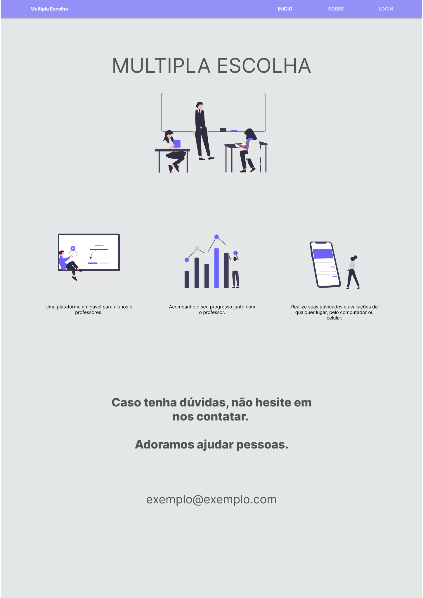

### Tela: Entrar (Sign in)

Nesta tela o usuário poderá inserir o usuário e a senha para se conectar ou clicar no botão "[Cadastre-se](#tela-registrar-se-sign-up)" para se cadastrar.

    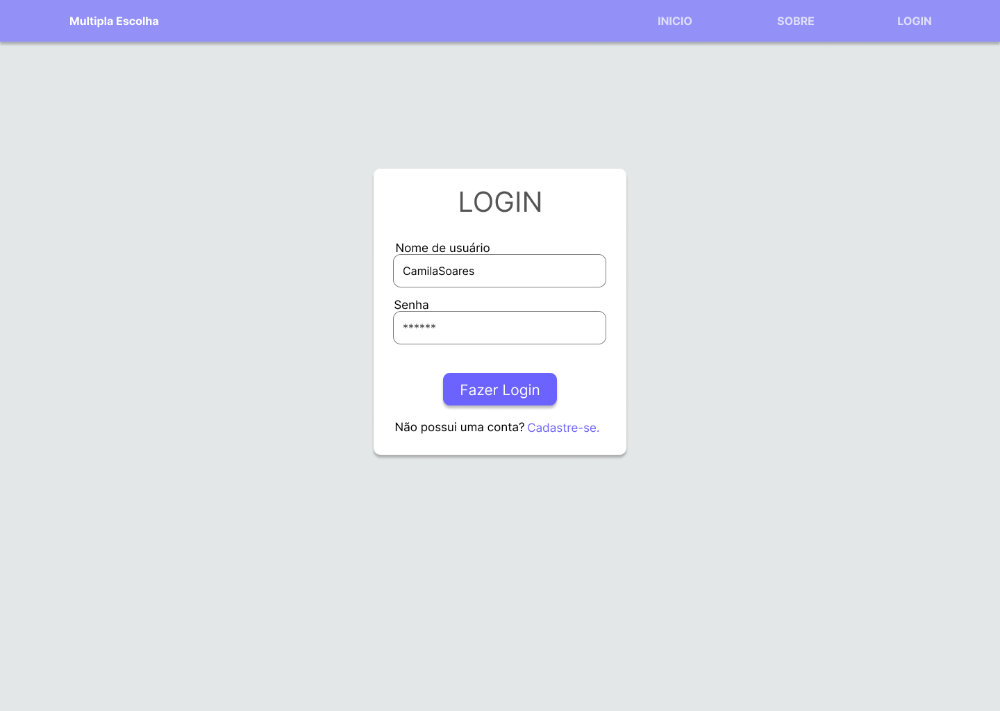

### Tela: Registrar-se (Sign up)

Nesta tela o usuário vai criar sua conta de usuário ao inserir os dados necessários nos campos disponíveis, selecionar o seu perfil como "Aluno" ou "Professor" e confirmar. Ao confirmar e o processo ser concluido com sucesso, o usuário poderá [ir fazer o *login*](#tela-entrar-sign-in).

    

### Tela: Dados de Usuário

Esta tela é acessível apenas para usuários conectados. Nela o usuário poderá editar informações que cadastrou anteriormente e também excluir a conta. O menu de navegação presente na *Homepage* desaparece nesta tela. O cabeçalho passa a apresentar a logo e um botão *dropdown* com as opções *Turmas*, para levar o usuário à tela "[Minhas Turmas](#tela-minhas-turmas)", *Perfil*, para levar o usuário à tela "[Meus Dados](#tela-dados-de-usuário)" ou se desconectar.

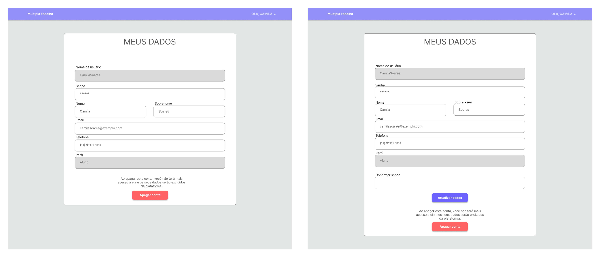

#### Menu do botão *dropdown*

### Tela: Minhas Turmas

#### Para o professor

Esta tela é acessível apenas para usuários conectados como "Professor". Nela o usuário poderá abrir, editar ou excluir turmas já criadas. Também poderá filtrar o resultado das turmas por "Ativas" ou "Inativas" e criar uma turma ao clicar em "[Criar turma](#tela-criar-e-editar-turma)".

    

#### Para o aluno

Esta tela é acessível apenas para usuários conectados como "Aluno". Nela o usuário visualizará as turmas que está matriculado e notificações de novas atividades, atividades pendentes ou atrasadas em cada turma. Também poderá fazer uma busca por turmas.

    

### Tela: Criar e Editar Turma

Esta tela é acessível apenas para usuários conectados como "Professor". Nela o usuário poderá criar uma turma ao inserir os dados necessários nos campos disponíveis e selecionar se a turma está "Ativa" ou "Inativa". Caso a turma já esteja criada e o usuário queira atualizar informações, será carregada uma página semelhante com dados já preenchidos que que o usuário poderá alterar.

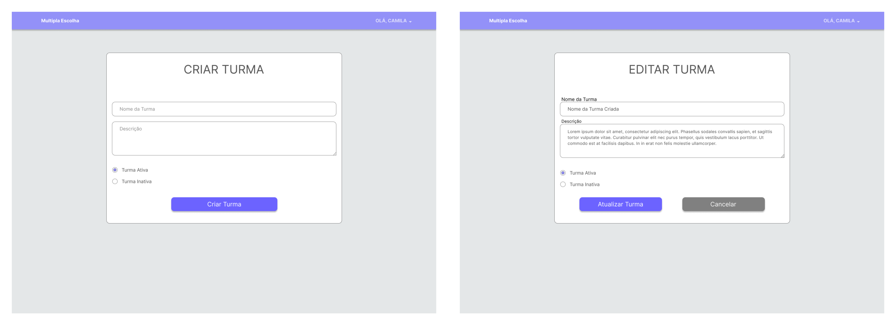

### Tela: Buscar Turma

Na tela de busca, o usuário vai encontrar campos para filtrar o resultado da turma que está buscando, por nome da turma ou por nome ou email do professor. Após realizar a busca, receberá uma lista com os resultados e poderá clicar em uma turma para entrar.

    

### Tela: Visualizar Turma

#### Para o professor

Esta tela é acessível apenas para usuários conectados como "Professor". Nela o usuário visualizará a turma criada. Também poderá ver o resultado dos alunos clicando no botão "Notas" ou criar uma atividade clicando em "[Criar Atividade](#tela-criar-e-editar-atividade)". Caso a turma já tenha atividades criadas, o usuário poderá "[Abrir](#tela-visualizar-atividade)", "[Editar](#tela-criar-e-editar-atividade)" ou "Deletar" as atividades.

    

#### Para o aluno

Esta tela é acessível apenas para usuários conectados como "Aluno". Nela o usuário visualizará a turma que está matriculado e as atividades com avisos de *pendente*, *atrasada* ou *entregue* em cada uma e informações de *prazo* e *data de criação*, o usuário poderá abrir a atividade clicando no *card* que irá abrir a [tela de visualização da atividade](#tela-visualizar-atividade). Também poderá cancelar a matrícula na turma aberta ou ver as suas notas na turma clicando no botão "Notas".

    

### Tela: Visualizar Atividade

Esta tela apresenta detalhes da atividade que o usuário abriu. Nela o usuário visualizará o *Nome da Atividade*, *Descrição*, as *Questões* e *Alternativas*, *Pontuação Total da Atividade*, *Prazo* e *Tentativas Permitidas*. A tela também possui um botão "[Fazer Atividade](#tela-realizar-atividade)" que o usuário poderá clicar para responder a atividade.

Ao realizar uma tentativa respondendo a atividade, um histórica das tentativas aparecerá na tela, com o *Número da Tentativa*, *Data e Hora*, *Pontuação Obtida* e um botão para ver a "[Correção](#tela-visualizar-correção)" de cada tentativa.

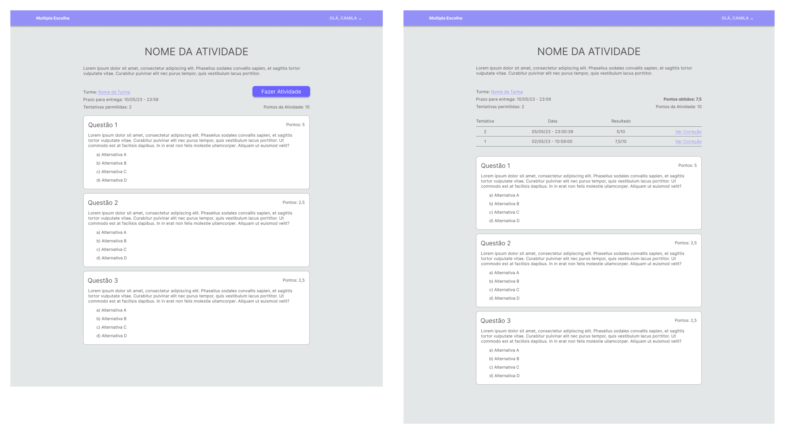

### Tela: Realizar Atividade

Esta tela é acessada quando o usuário "Aluno" clica no botão "Fazer Atividade". Nela o usuário poderá responder as questões da atividade respeitando as regras criadas para ela, como *Prazo* e *Número de Tentativas*. Ao terminar de responder a atividade, o aluno deve clicar em "Finalizar tarefa" para confirmar o envio.

    

### Tela: Visualizar Correção

Nesta tela o usuário poderá ver a correção da atividade, com a pontuação obtida e as respostas marcadas como corretas ou incorretas.

    

### Tela: Criar e Editar Atividade

Esta tela é acessível apenas para usuários conectados como "Professor". Nela o usuário encontrará campos para criar a atividade, como *Nome*, *Descrição*, *Prazo* e *Número de Tentativas*. Também encontrará uma área para visualizar e criar as questões, ao clicar no botão "Adicionar Questão", aparecerá um *modal* com campos para *Enunciado*, *Pontos da Questão*, *Quantidade de Alternativas*, a *Alternativa Correta* e campos para o texto das alternativas.

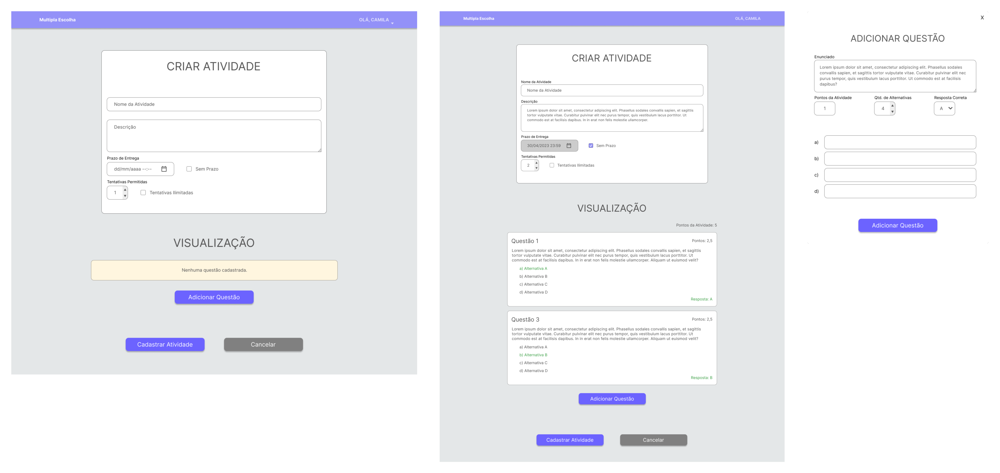

### Tela: Selecionar aluno para visualizar notas

Na tela de selecionar aluno para visualizar notas, o usuário do tipo "Professor" vai encontrar um campo para filtrar o aluno que está buscando por nome ou email. Após realizar a busca, receberá uma lista com o resultado da busca e poderá clicar em um aluno para abrir a visualização das notas, usuários do tipo "Aluno" serão diretamente direcionados para a tela de visualizar notas (mostrando as notas do mesmo).

    

### Tela: Visualizar Notas

Nessa tela o usuário poderá visualizar todas as notas das atividades da turma selecionada para um determinado usuário. No caso do usuário "Aluno", o usuário em questão será ele mesmo. No caso do usuário do tipo "Professor", o usuário cujas notas serão mostradas será aquele que ele selecionou na tela de "Selecionar aluno para visualizar notas".

    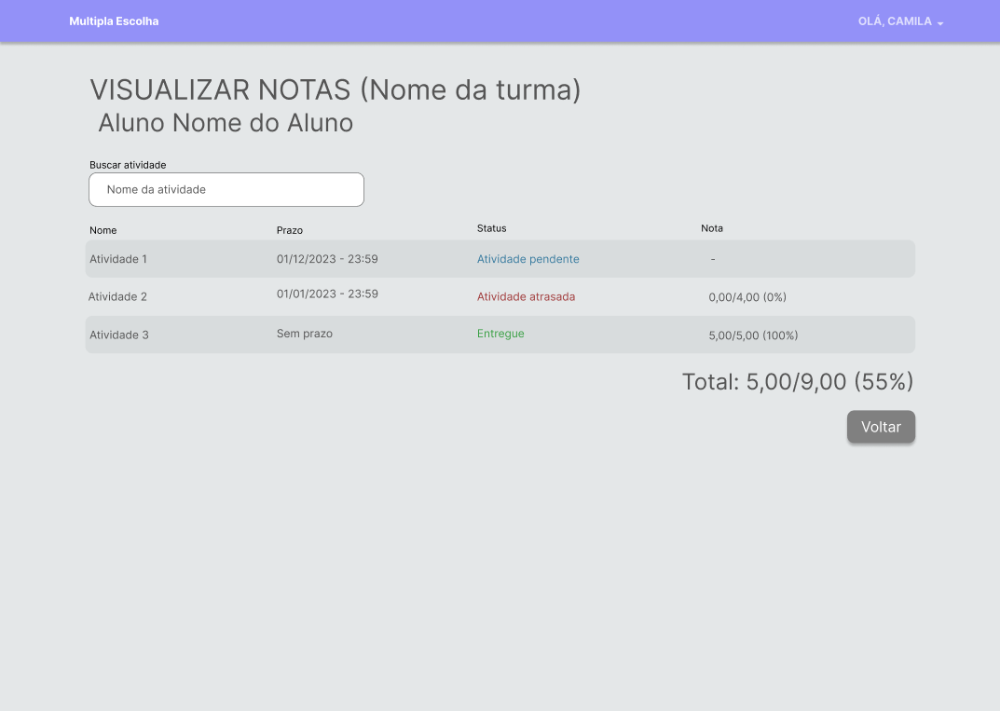

### Tela: Visualizar Notificações

Nessa tela o usuário poderá receber e visualizar todas as notificações de atividades recém cadastradas ou perto do prazo de entrega para turmas das quais ele faz parte.

   

## Wireframes: Mobile

Conforme o fluxo de telas do projeto, apresentado no item anterior, as telas do sistema *mobile* são apresentadas em detalhes nos itens a seguir. Para visualizar os wireframes no ambiente do Figma, [**acesse aqui**](https://www.figma.com/file/VQl2rH2pC1QqMkM4mbQPi9/Aplica%C3%A7%C3%A3o-Mobile).

Para acessar a versão interativa do Wireframe, [**acesse aqui**](https://www.figma.com/proto/VQl2rH2pC1QqMkM4mbQPi9/Aplica%C3%A7%C3%A3o-Mobile).

As telas do sistema apresentam uma estrutura comum que é apresentada em [Template Padrão da Aplicação](./06-Template%20Padr%C3%A3o%20da%20Aplica%C3%A7%C3%A3o.md).

### Tela: Início (Homepage)

A primeira tela que o usuário verá ao acessar o app. Nela o usuário encontrará botoões para fazer [login](#tela-entrar-sign-in-1) ou [cadastrar-se](#tela-registrar-se-sign-up-1).

    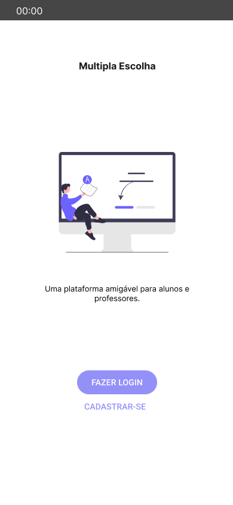

### Tela: Entrar (Sign in)

Nesta tela o usuário poderá inserir o usuário e a senha para se conectar ou clicar no botão "[Cadastre-se](#tela-registrar-se-sign-up-1)" para se cadastrar.

    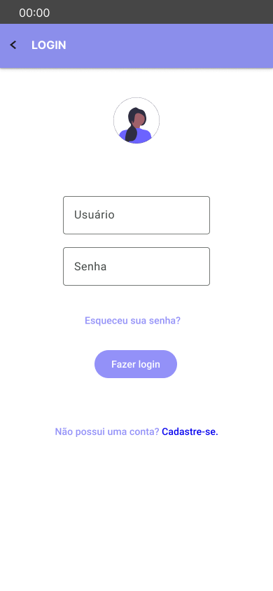

### Tela: Registrar-se (Sign up)

Nesta tela o usuário vai criar sua conta de usuário ao inserir os dados necessários nos campos disponíveis, selecionar o seu perfil como "Aluno" ou "Professor" e confirmar. Ao confirmar e o processo ser concluido com sucesso, o usuário poderá [ir fazer o *login*](#tela-entrar-sign-in-1).

    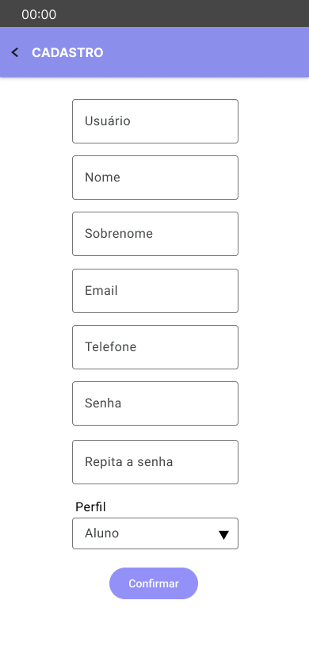

### Tela: Dados de Usuário

Esta tela é acessível apenas para usuários conectados. Nela o usuário poderá editar informações que cadastrou anteriormente e também excluir a conta. O menu de navegação presente na *Homepage* desaparece nesta tela. O cabeçalho passa a apresentar a logo e um botão *dropdown* com as opções *Turmas*, para levar o usuário à tela "[Minhas Turmas](#tela-minhas-turmas-1)", *Perfil*, para levar o usuário à tela "[Meus Dados](#tela-dados-de-usuário-1)" ou se desconectar.

#### Menu do botão *dropdown*

### Tela: Minhas Turmas

#### Para o professor

Esta tela é acessível apenas para usuários conectados como "Professor". Nela o usuário poderá abrir, editar ou excluir turmas já criadas. Também poderá filtrar o resultado das turmas por "Ativas" ou "Inativas" e criar uma turma ao clicar em "[Criar turma](#tela-criar-e-editar-turma-1)".

    

#### Para o aluno

Esta tela é acessível apenas para usuários conectados como "Aluno". Nela o usuário visualizará as turmas que está matriculado e notificações de novas atividades, atividades pendentes ou atrasadas em cada turma. Também poderá fazer uma busca por turmas.

    

### Tela: Criar e Editar Turma

Esta tela é acessível apenas para usuários conectados como "Professor". Nela o usuário poderá criar uma turma ao inserir os dados necessários nos campos disponíveis e selecionar se a turma está "Ativa" ou "Inativa". Caso a turma já esteja criada e o usuário queira atualizar informações, será carregada uma página semelhante com dados já preenchidos que que o usuário poderá alterar.

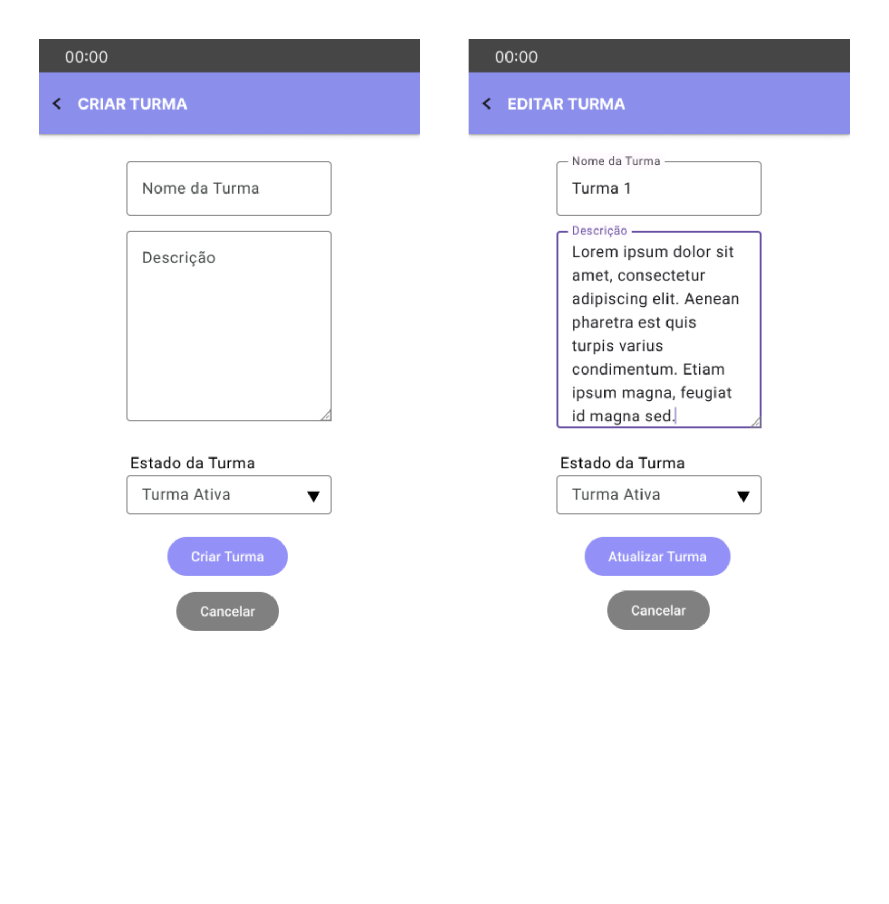

### Tela: Buscar Turma

Na tela de busca, o usuário vai encontrar campos para filtrar o resultado da turma que está buscando, por nome da turma ou por nome ou email do professor. Após realizar a busca, receberá uma lista com os resultados e poderá clicar em uma turma para entrar.

    

### Tela: Visualizar Turma

#### Para o professor

Esta tela é acessível apenas para usuários conectados como "Professor". Nela o usuário visualizará a turma criada. Também poderá ver o resultado dos alunos clicando no botão "Notas" ou criar uma atividade clicando em "[Criar Atividade](#tela-criar-e-editar-atividade-1)". Caso a turma já tenha atividades criadas, o usuário poderá "[Abrir](#tela-visualizar-atividade-1)", "[Editar](#tela-criar-e-editar-atividade-1)" ou "Deletar" as atividades.

    

#### Para o aluno

Esta tela é acessível apenas para usuários conectados como "Aluno". Nela o usuário visualizará a turma que está matriculado e as atividades com avisos de *pendente*, *atrasada* ou *entregue* em cada uma e informações de *prazo* e *data de criação*, o usuário poderá abrir a atividade clicando no *card* que irá abrir a [tela de visualização da atividade](#tela-visualizar-atividade-1). Também poderá cancelar a matrícula na turma aberta ou ver as suas notas na turma clicando no botão "Notas".

    

### Tela: Visualizar Atividade

Esta tela apresenta detalhes da atividade que o usuário abriu. Nela o usuário visualizará o *Nome da Atividade*, *Descrição*, as *Questões* e *Alternativas*, *Pontuação Total da Atividade*, *Prazo* e *Tentativas Permitidas*. A tela também possui um botão "[Fazer Atividade](#tela-realizar-atividade-1)" que o usuário poderá clicar para responder a atividade.

    

### Tela: Realizar Atividade

Esta tela é acessada quando o usuário "Aluno" clica no botão "Fazer Atividade". Nela o usuário poderá responder as questões da atividade respeitando as regras criadas para ela, como *Prazo* e *Número de Tentativas*. Ao terminar de responder a atividade, o aluno deve clicar em "Finalizar Atividade" para confirmar o envio.

    

### Tela: Visualizar Correção

Nesta tela o usuário poderá ver a correção da atividade, com a pontuação obtida e as respostas marcadas como corretas ou incorretas.

    

### Tela: Criar e Editar Atividade

Esta tela é acessível apenas para usuários conectados como "Professor". Nela o usuário encontrará campos para criar a atividade, como *Nome*, *Descrição*, *Prazo* e *Número de Tentativas*. Também encontrará uma área para visualizar e criar as questões, ao clicar no botão "Adicionar Questão", aparecerá um *modal* com campos para *Enunciado*, *Pontos da Questão*, *Quantidade de Alternativas*, a *Alternativa Correta* e campos para o texto das alternativas.

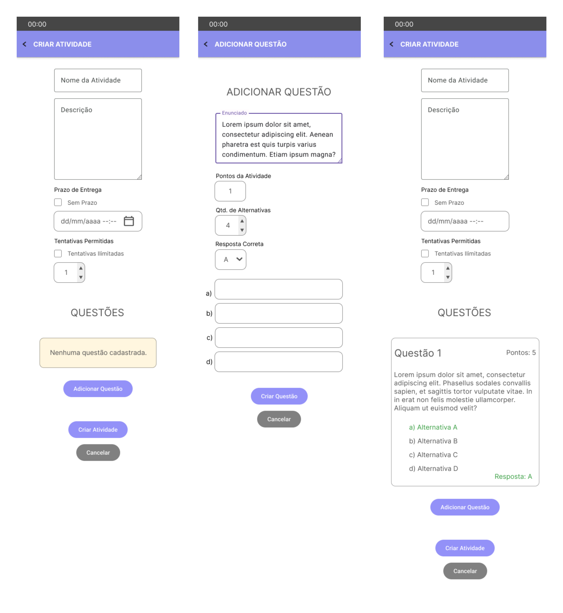

### Tela: Selecionar aluno para visualizar notas

Na tela de selecionar aluno para visualizar notas, o usuário do tipo "Professor" vai encontrar uma lista de aluno da turma e poderá clicar em um aluno para abrir a visualização das notas, usuários do tipo "Aluno" serão diretamente direcionados para a tela de visualizar notas (mostrando as notas do mesmo).

    

### Tela: Visualizar Notas

Nessa tela o usuário poderá visualizar todas as notas das atividades da turma selecionada para um determinado usuário. No caso do usuário "Aluno", o usuário em questão será ele mesmo. No caso do usuário do tipo "Professor", o usuário cujas notas serão mostradas será aquele que ele selecionou na tela de "[Selecionar aluno para visualizar notas](#tela-selecionar-aluno-para-visualizar-notas-1)".

    

### Tela: Visualizar Notificações

Nessa tela o usuário poderá receber e visualizar todas as notificações de atividades recém cadastradas ou perto do prazo de entrega para turmas das quais ele faz parte.

    

   

