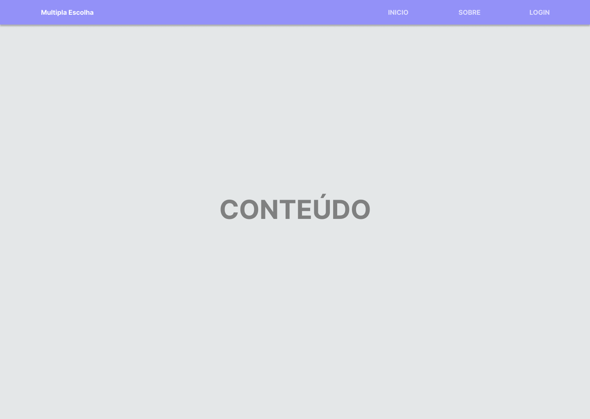
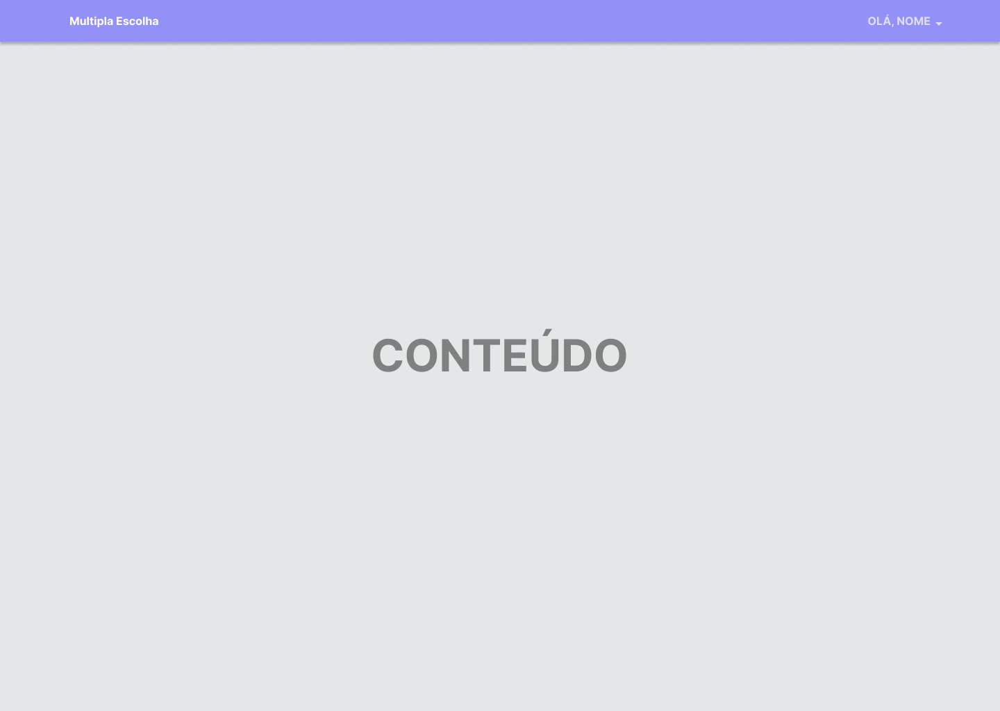

# Template Padrão da Aplicação

Nesta estrutura, existem 2 grandes blocos, descritos a seguir. São eles:  
* **Cabeçalho** - local onde são dispostos elementos fixos de identidade (logo), acesso à conta pessoal, sobre, turmas, perfil e sair;
* **Conteúdo** - apresenta o conteúdo da tela em questão.

### Páginas com o usuário desconectado

As telas onde o usuário estiver desconectado apresentará um cabeçalho com opções de *Início*, *Sobre* e *Login*.

### Páginas com o usuário conectado

As telas onde o usuário estiver conectado apresentará um cabeçalho com botão *dropdown* com a mensagem de "Olá, {nome do usuário da sessão}" e opções de *Turmas*, *Perfil* e *Sair*.

#### Menu do botão *dropdown*

## Cores e Fontes

### Cores

#9391F8 - Principal (Lilás)  
#E4E7E8 - Tela de Fundo  
#555555 - Texto  

#AC5353 - Vermelho  
#3AA044 - Verde  
#3A7CA0 - Azul  
#FFFFFF - Branco  
#000000 - Preto  

### Fontes

#### Título:
Inter 40 Regular  
**Inter 40 Extra Bold**  

#### Texto comum:
Inter 16 Regular  
**Inter 16 Bold**  

## Ilustrações

Foram utilizadas ilustrações do pacote [unDraw](https://undraw.co/illustrations), disponíveis gratuitamente para uso comercial ou pessoal. [Licença](https://undraw.co/license).